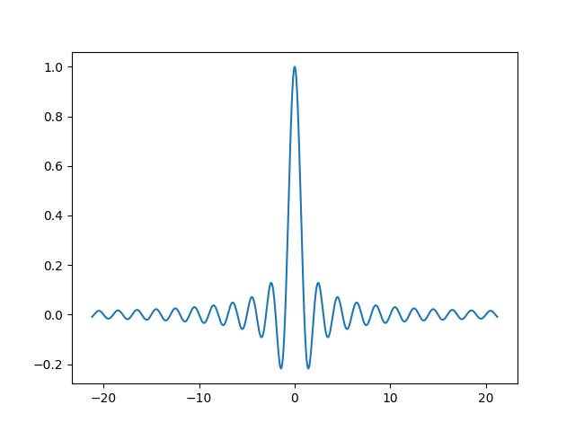

# OdinMathandPhysics
Math and Physics simple procedures inspired by python libraries like numpy, scipy, etc.

This repo i made as i'm going forward learning [Odin](https://github.com/odin-lang/Odin). Things might get comlicated as time goes, but i'll do
my best to keep it as neat as possible.

You're very welcome to replicate/use/do whatever you want to do
with this repo. I encourage you to write yourown stuff as well
as we are all have the right to learn from anything.

i'm just making my tooling as i'm learning odin. im doing geo, physics, and everything in between.
Such that, following things are what i need:

---

1. working with mathematical object i.e. vectors, matrix, arrays in 1D, 2D, 3D, and so on so forth.
2. I need some kinda functionalities i can get from [numpy](https://github.com/numpy/numpy) and/or [scipy](https://github.com/scipy/scipy)
3. basically plotting so i can see things. game engine in odin (currenlty) are just too much, i might get there at some point cz 3D data needs specific way to be visualized.

---

## What's inside this thing?

### [Matrix Operation](./mathandphysics/matrixoperations.odin)

self-explanatory itself.

### [Trigonometries thinggy](./mathandphysics/trigonometries.odin)

related to angles, sin cos and their frens
more -> [md Docs](./md_docs/trigonometries.md) (still empty, tho)

### [utils](./mathandphysics/utils.odin)

things i don't know where to put yet.

### Plotting with [ GNUPlot ](https://sourceforge.net/projects/gnuplot/)

prereq.: `GNUPlot`
i'm currenlty using `gnuplot 6.0 patchlevel 2`
if you wanna use the [mpplot(just got it's first push)](./mpplot) make sure you have gnuplot installed!

## Some snippets of what i've been building so far (using GNUPlot)

### mimic [`numpy.linspace and numpy.sinc`](https://numpy.org/doc/2.1/reference/generated/numpy.linspace.html)

you can try the following yourself, just run `make` in the root of this repo.
if you don't have `make` installed, just run `odin build ./test/mpplot/plot_sinc_gnuplot.odin -file` and try callit!


| OdinMathandPhysics-GNUPlot | Numpy-Matplotlib |
| -------------- | --------------- |
|  |  |


_nb:just to verify that, since i'm mimicing numpu, run this command on your terminal
also make sure your python has numpy and matplotlib installed. (here i'm using py3.10)_
```
py -3.10 -c "import numpy as np; import matplotlib.pyplot as plt; plt.plot(np.linspace(-21.2, 21.2, 2000), np.sinc(np.linspace(-21.2, 21.2, 2000))); plt.show()"
```
